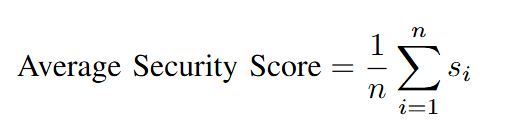
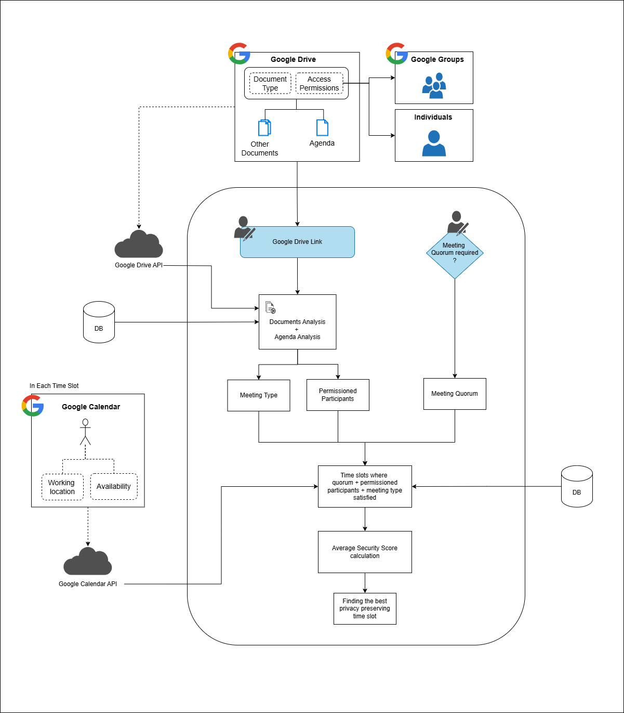

## Implementation

### Overview

This project implements a **Privacy-Aware Meeting Scheduling Decision Support System (DSS)** using **Python** and **Streamlit**, integrated with **Google Workspace APIs**.  
The system intelligently recommends feasible and privacy-preserving meeting arrangements by analyzing **participant availability**, **document confidentiality**, and **access permissions**.

---

### Google Workspace Integration

The system integrates multiple Google services to support privacy-aware scheduling:

- **Google Drive API** – Used to fetch meeting-related documents and their sharing permissions. Each file carries a confidentiality label (`Public` or `Private`), and access rights are derived from Google Drive’s native sharing configurations.
- **Google Groups API** – Enables scalable **role-based access control (RBAC)**. Permissions are assigned to groups, which are then expanded into individual users during participant resolution.
- **Google Calendar API** – Provides structured data on participants’ **availability** and **work location**. This information is used to identify feasible and privacy-compliant time slots.

---

### Scheduling Workflow

1. **Input Phase**

   - The user provides a Google Drive folder link containing meeting materials.
   - The system fetches metadata for all files in the folder.

2. **Metadata Extraction**

   - Parses documents to extract:
     - Access permissions
     - Confidentiality levels
     - Group memberships

3. **Participant Determination**
   The system follows a structured process:

   1. **Document Access Resolution** – Expands group-level permissions into individual users.
   2. **Confidentiality Filtering** – Applies:
      - **Union logic** for _public documents_
      - **Intersection logic** for _private documents_
   3. **Agenda-Based Filtering** – Ensures all participants have access to the agenda file.
   4. **Minimum Participation Check** – Validates that at least two participants are eligible.

4. **Time Slot Identification**

   - Retrieves calendar data within the **user-defined date range**.
   - Classifies participant locations as:
     - `Onsite`
     - `Remote Private`
     - `Remote Public`
   - Applies meeting type filters:
     - **Public meetings** accept all locations.
     - **Private meetings** require secure (onsite/private) locations.
   - Enforces **quorum requirements** to ensure sufficient participants per time slot.

5. **Privacy-Aware Slot Ranking**
   Each valid time slot is scored using the **Average Security Score**:

   

   where \( s*i \) is the security score of the \_i-th* participant’s location:

   - Work (Most Secure): `1`
   - Home: `2`
   - Remote Public (Least Secure): `3`

   The slot with the **lowest average score** is recommended as the most privacy-preserving option.

---

### Features

- Privacy-aware participant selection
- Role-based access control using Google Groups
- Automated document and calendar permission checks
- Quorum-based slot validation
- Location-sensitive meeting recommendations
- Streamlit-based interactive user interface

---

### Tech Stack

| Category           | Technology                                               |
| ------------------ | -------------------------------------------------------- |
| **Frontend**       | Streamlit                                                |
| **Backend**        | Python                                                   |
| **APIs Used**      | Google Drive API, Google Calendar API, Google Groups API |
| **Authentication** | OAuth 2.0 (via Google API Client)                        |
| **Data Handling**  | JSON, Pandas                                             |
| **Deployment**     | Streamlit Cloud / Local Execution                        |

---

### System Architecture

### Steps to Run

#### **1. Clone the Repository**

### **2. Get the `user_secrets` or `credentials.json` File**

Obtain your **Google OAuth 2.0 credentials** (commonly named `credentials.json`, or use Streamlit’s `secrets.toml` when deploying).
Place it in the **root directory** of the project.

Ensure it includes authorized access for the following APIs:
- Google Drive API  
- Google Calendar API  
- Google Groups API

#### **3. Run application**
streamlit run app.py

#### **4. Access the Web App**
Once running, open the local URL displayed in the terminal (e.g., `http://localhost:8501`).
Log in with your **Google account** to authorize API access.
